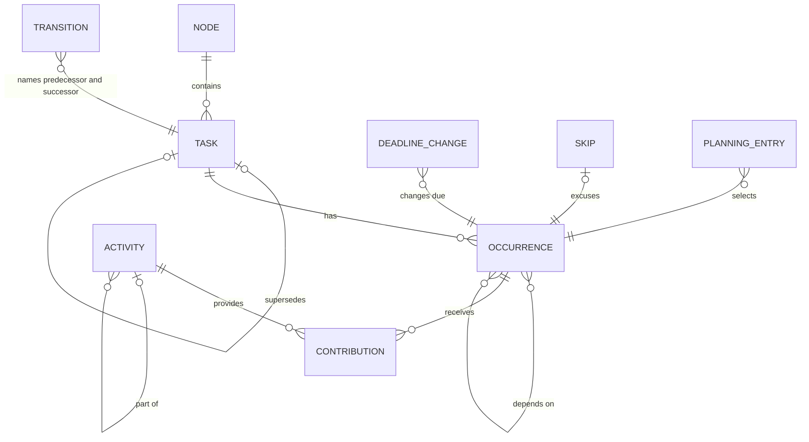

# Momiji candidate data model

Tranche 1 candidate, prepared from the design discussion of 2026-10-04.

This document proposes entities, references, lifecycle rules, derived information,
and invariants for review. It is not a protobuf schema. Field names are discussion
vocabulary, not an API commitment; no protobuf syntax or edition, field numbers, or
Rust dependencies are selected. Worked records appear in
[model scenarios](model-scenarios.md). Broader requirements are in the
[design checkpoint](design.md), and remaining work is in the [backlog](backlog.md).

## Status labels

| Label | Meaning |
|---|---|
| **Agreed** | Direction accepted in design discussion; changing it needs a new decision |
| **Proposed** | Recommended default or bounded initial behavior, open to review |
| **Open** | Unresolved and not a requirement; cross-referenced as Q1–Q10 under [open questions](#open-questions) |

Section headings carry a label where the whole section shares it. Individual items
are labeled where they differ.

## Foundation (Agreed)

Record activity once. Allow it to contribute to multiple expectations. Organize and
assess expectations without duplicating the underlying activity.

Intent is separate from experience:

- **Tasks** express intentions or responsibilities.
- **Occurrences** express particular obligations or opportunities of a task.
- **Activities** record what actually happened, including unplanned activity.
- **Contributions** associate an activity with an occurrence it helps satisfy.
- **Assessments** derive progress and satisfaction from the applicable rules and
  contributions.
- Organizational structure and personal planning are separate concerns.

The ordinary checkbox interaction creates the appropriate records together, typically
an activity and a contribution, plus the occurrence record if it was not yet stored.
A simple completion never requires navigating the full model.

Momiji does not require a timeline of every minute. Activities may overlap or have
different granularity, such as a workout and its constituent exercises, and one
person may have several concurrent activities. A session and its parts must not
count as several visits merely because several records exist; measurement and
allocation beyond session counts remain open (Q6).

## Facts, decisions, and derived information

| Category | Examples | Persisted |
|---|---|---|
| Facts asserted by users | Activities; corrections and retractions of activities | Yes, append-oriented with a trace |
| User decisions | Task definitions, contributions and their removal, skips, supersession transitions, deadline changes, dependencies, planning entries | Yes |
| Derived information | Computed occurrences, assessments, overdue status, parent summaries, a task's displayed "completed" or "superseded" state | No; caches are rebuildable and never authoritative |

**Agreed:** assessments are derived from expectations, activity, exceptions, and an
explicit evaluation time. **Proposed:** the classification of display states above.

## Entities

### Task

| Candidate field | Notes |
|---|---|
| `id` | UUID. Never a title, abbreviation, hierarchy path, or Git remote URL |
| `title`, `short_title` | Descriptive; editable without changing identity |
| `node` | Organizational node UUID; node schema is not defined here |
| `personae` | Persona UUIDs; persona schema is not defined here |
| `expectation` | Mode and, for recurring tasks, generation, satisfaction, and lapse behavior; fixed for this UUID |
| `completion_meaning` | Optional text explaining what counts as done, such as "payment submitted" rather than "cleared" |
| `lifecycle` | Active or retired, see below |
| `parent` | Decomposition parent; cardinality is open (Q8) |
| `supersedes` | Predecessor task UUID; graph constraints are open (Q7) |

`completion_meaning` is explanatory text for people. **Agreed:** Momiji does not
verify external systems, infer completion semantically, or evaluate a predicate
language. An explicit user completion assertion is sufficient.

Task lifecycle:

- **Active**: holds or generates obligations.
- **Retired**: intentionally ended without a successor. It stops generating
  occurrences. **Proposed:** open occurrences are handled explicitly, as for a
  supersession transition.
- **Superseded**: **Proposed** as derived from a transition naming the task as
  predecessor. Whether the predecessor record also carries a marker is open (Q7).
- **Completed**: one-time tasks only. **Proposed** as derived from the task's single
  occurrence being satisfied. Ongoing and recurring tasks never complete by
  satisfying occurrences.

Deletion is distinct from retirement and is not designed in this tranche.

### Expectation

Expectation modes (**Agreed**):

| Mode | Occurrences | Completes | Lapse strategy |
|---|---|---|---|
| One-time | Exactly one; may be undated | Yes, when its occurrence is satisfied | Not applicable |
| Ongoing | None (**Proposed** for this tranche) | Never by itself; ends only by retirement or supersession | Not applicable |
| Recurring | Generated by an explicit strategy | No; each occurrence resolves independently | Required |

An undated one-time task is not an ongoing responsibility: it is still expected to
be completed eventually.

For recurring tasks, **generation**, **satisfaction**, and **lapse** are distinct
parts of the expectation. Their combinations are validated.

**Generation strategies.** These are prose descriptions; enum names are not final.

- **Calendar periods.** Each local day, week, month, quarter, half-year, or year in a
  stated time zone and calendar, with a stated week start where relevant. The
  occurrence's period is `[start, end)`.
- **Fixed elapsed intervals.** Repeats every stated interval from an anchor,
  independent of when work is completed. An example is every 14 days from a chosen
  date.
- **After a qualifying completion.** The next occurrence becomes available a stated
  interval after the previous occurrence is satisfied. An example is replacing a
  filter 90 days after it was last replaced. Which time triggers the interval is open
  (Q2): activity time, recording time, or contribution time.

**Satisfaction** (this tranche):

- `minimum`: the number of distinct contributing activities that satisfies the
  occurrence. **Proposed:** default 1, and at least 1. Whether a zero minimum is
  useful for purely aspirational targets is open.
- `preferred`: optional, at least `minimum`. Reaching it is a reported attainment,
  not a cap. **Agreed:** "gym 2–3 times weekly" means minimum 2 and preferred 3. A
  fourth visit remains recordable.
- Measures other than session counts, such as duration, distance, or amount, are
  open (Q6).

**Lapse strategies** (**Agreed** alternatives):

| Behavior | Meaning |
|---|---|
| Lapse | Closed unsatisfied periods remain historical; no obligation is carried forward |
| Keep one outstanding | Missed periods do not multiply the work owed |
| Accumulate | Distinct unsatisfied obligations remain owed |

**Compatibility matrix** (**Proposed**; "rejected" means validation refuses the
definition rather than inventing behavior):

| Generation | Lapse | Keep one outstanding | Accumulate | Strategy omitted |
|---|---|---|---|---|
| None, one-time task | Rejected | Rejected | Rejected | Required |
| None, ongoing task | Rejected | Rejected | Rejected | Required |
| Calendar periods | Valid | Valid; coalescing is Q2 | Valid | Rejected |
| Fixed elapsed intervals | Valid | Valid; coalescing is Q2 | Valid | Rejected |
| After a qualifying completion | Rejected: nothing closes an occurrence | Valid; inherent | Rejected: not meaningful (**Agreed**) | Rejected |

For the completion-relative strategy, one outstanding obligation is inherent. The
proposal still requires the record to state it, so records stay self-describing and
no default is invented. Whether a variant with an explicit satisfaction window is
useful is part of Q2.

**Strategy behavior:**

- **Lapse.** When an occurrence's period ends below its minimum, the derived
  resolution is closed unsatisfied. Nothing carries forward. **Proposed:** a
  contribution to a closed lapse occurrence must use activity that occurred within
  its period. Late recording is allowed; late work does not retroactively satisfy a
  lapsed period.
- **Accumulate.** Each unsatisfied occurrence stays open with its own remaining
  requirement. **Agreed preference:** keep the original occurrence rather than an
  undifferentiated debt counter. Later activity may contribute to an older open
  occurrence. **Proposed:** each owed occurrence is shown separately, and the user's
  explicit target decides where credit goes. Automatic allocation for bulk or imported
  activity is open (Q2).
- **Keep one outstanding.** **Agreed:** missed periods do not multiply the work owed.
  The exact semantics are open (Q2). Two candidate interpretations follow, and
  [scenario A](model-scenarios.md#a-daily-stretching) shows the consequences of each:
  - **Candidate K-A, one carried plus current.** At most one obligation from closed
    periods remains open alongside the current period's own occurrence. Later
    unsatisfied periods coalesce into the carried one, which may be the oldest or the
    newest; that choice is a sub-question. The user can see two items to do.
  - **Candidate K-B, merge into current.** When a period closes unsatisfied, its
    remaining requirement merges into the next period's occurrence. One merged
    obligation is owed. For a minimum of 1 this resembles Lapse with different
    history. For larger minimums, the merged requirement rule is undefined: the
    larger of the two, their sum with a cap, or some other rule. Whether skipping the
    absorbing period also excuses carried work is undefined too.

### Occurrence

| Candidate field | Notes |
|---|---|
| `id` | UUID once stored; addressing of computed occurrences is open (Q1) |
| `task` | Owning task. Its expectation interprets this occurrence permanently |
| `period` | Applicable period `[start, end)` for recurring tasks; absent for one-time tasks (**Proposed**) |
| `period_key` | Canonical label such as `2026-10-02`, `2026-W41`, or a cycle start; a candidate addressing input (Q1) |
| `available_from` | Optional earliest availability |
| `due` | Optional. Whether it is a date or an instant is open (Q3); its current value reflects deadline changes |
| `depends_on` | Optional prerequisite occurrence UUIDs; enforcement is open (Q8) |

The **applicable period** is what the obligation concerns, such as this day, this
week, or this coverage cycle. It is not an invented deadline (**Agreed**). Under
Lapse, the period's end is when an unsatisfied occurrence closes. Under Accumulate
and Keep one outstanding, the occurrence can remain owed after its period. A due date
is separate and optional.

**Materialization (Proposed).** Predictable occurrences are computed and not stored
eagerly. An occurrence is persisted only when something must reference or modify it,
and always for a one-time task. References include a contribution, skip, deadline
change, dependency, transition decision, or planning entry. **Agreed:** empty periods
are never stored as negative records.

**Addressing computed occurrences (Open, Q1).** Contributions must not reference
computed occurrences across replicas until this is settled. Candidates:

1. A deterministic key from the task UUID and canonical period key. Replicas converge
   without coordination. This is sound because a task's recurrence never changes
   under its UUID; substantive changes create successors. The key is not UUID-shaped.
2. A name-based UUID derived from candidate 1. It is UUID-shaped and deterministic,
   but the namespace and canonical encoding need definition.
3. A random UUID minted on first storage. This needs a merge rule when two replicas
   store the same period offline.

Completion-relative occurrences have no calendar key. A sequence number or a
reference to the previous occurrence is a candidate input.

**Resolution vocabulary (Proposed).** **Agreed:** superseded, completed, unsatisfied,
and overdue are not synonyms.

| Resolution | Source | Meaning |
|---|---|---|
| Open | Derived | Still actionable |
| Satisfied | Derived | Minimum met. Within its period it still accepts credit toward the preferred target |
| Skipped | Persisted decision | Explicitly excused; not a failure |
| Closed unsatisfied | Derived | Lapse: the period ended below its minimum |
| Coalesced | Derived | Keep one outstanding: absorbed into another outstanding obligation |
| Closed as superseded | Persisted through a transition | Ended by task replacement, with no verdict on the remainder |
| Withdrawn | Persisted through retirement | The task was retired while this occurrence was open |

**Overdue** is a status of an open occurrence whose current due value has passed. It
is not a resolution, and passing a due date alone never closes an obligation
(**Agreed**). **Attainment** is reported independently of resolution: none, partial,
minimum met, or preferred met.

Derived resolutions are recomputed whenever facts change. A day assessed as closed
unsatisfied becomes satisfied if an activity that happened on that day is recorded
later.

### Activity

| Candidate field | Notes |
|---|---|
| `id` | UUID |
| `actors` | Actor UUIDs where relevant. Actor schema and attribution rules are open (Q5) |
| `description` | Free text |
| `occurred` | When it actually happened: an instant, an interval, or a date with stated precision (Q3) |
| `recorded_at` | When it was entered into Momiji |
| `part_of` | Optional containing activity, such as an exercise within a session (Q6) |

**Agreed:**

- Activity is stored separately from task definitions.
- An activity can be recorded with no contributions, as unplanned activity, and
  associated with commitments later.
- Activity time and recording time are distinct. A workout entered the following
  morning counts in the period when it happened.
- Recording a fact in Momiji is different from performing a task in another system.
  For example, recording a payment in Momiji is not bookkeeping.
- A correction or retraction leaves a trace rather than silently rewriting history.
  It invalidates every assessment that uses the activity. The representation and
  authorization rules are open (Q5).

### Contribution

| Candidate field | Notes |
|---|---|
| `id` | UUID |
| `activity` | Activity UUID |
| `occurrence` | Explicit target occurrence |
| `credit` | This tranche: one session toward a count. Other measures are open (Q6) |
| `recorded_at` | When the association was made |

**Agreed:**

- One activity may contribute to several occurrences, each through its own
  contribution.
- A contribution does not imply its target is satisfied. One visit can advance a
  two-visit weekly minimum.
- The target is explicit and not allocated solely from the activity's timestamp, so
  an April activity can satisfy a March reporting obligation.
- Within a session-count target, one activity never counts twice toward the same
  occurrence through duplicate contribution records.
- Removing a contribution leaves the activity and its other contributions intact.

**Proposed:**

- Removing a contribution is recorded, for example as a removal record, so the
  changed assessment is explainable. The record shape is open (Q5).
- In a single source, validation rejects a second contribution with the same activity
  and occurrence. Duplicates that arrive through merging replicas are tolerated,
  counted once, and flagged for cleanup.
- For session-count targets, progress counts distinct root activities, following
  `part_of` to the outermost activity. A session and its exercises then count as one
  visit. This is a bounded initial rule; the general question is Q6.
- Initially, the activity and the occurrence must be in the same source. Cross-source
  contributions are open (Q9).

### Skip

A skip is an explicit user decision that excuses an occurrence, with an optional
reason. It stores the occurrence if needed. A skipped occurrence is not unsatisfied.
In contrast, an inferred lack of satisfaction is derived and never stored
(**Agreed**). The record shape is open (Q5).

### Assessment (derived)

Inputs:

- The expectation of the occurrence's own task.
- The occurrence and its period.
- Contributions whose activities have not been retracted, and contribution removals.
- Skips, transitions, retirements, and deadline changes.
- The evaluation time, plus stated time-zone, calendar, and week-start assumptions.
- The completeness of the relevant source data.

Outputs: progress count, minimum met, preferred met, resolution, overdue status, any
carried obligation, and an explanation that cites the records used.

**Agreed:** missing or unavailable source data is never proof that no activity
occurred. An assessment over incomplete data is reported as incomplete rather than
unsatisfied. The representation of completeness is open (Q9).

### Personal planning entry

| Candidate field | Notes |
|---|---|
| `id` | UUID |
| `workspace` | Planning workspace UUID |
| `target` | Task or occurrence UUID |
| `day` or `horizon` | Intended work day or horizon, such as this week |
| `order` | Position in the user's daily order |
| `note` | Private annotation |

**Agreed:**

- Planning entries are separate from shared task content.
- Selecting work for a day does not create a due date.
- A private annotation does not change shared data or access permissions.

### Supersession transition

| Candidate field | Notes |
|---|---|
| `id` | UUID |
| `predecessor`, `successor` | Task UUIDs |
| `effective_at` | Chosen boundary; the UI defaults to now (**Proposed**) |
| `open_occurrences` | Close as superseded, keep outstanding, or delay the transition until the existing boundary; optional per-occurrence overrides |
| `successor_start` | Explicitly an initial partial period or the first full period, with its start |
| `reason`, `recorded_at` | Audit information |

Whether this is a standalone record or another explicit auditable representation is
open (Q5).

### Deadline change

| Candidate field | Notes |
|---|---|
| `id` | UUID |
| `occurrence` | Target obligation; its identity is unchanged |
| `previous_due`, `new_due` | Both values are retained |
| `recorded_at`, `explanation` | When the change was recorded and, optionally, why |

**Proposed:** an occurrence's current due value is its original value with the
deadline changes applied in order. The record shape is open (Q5).

### Dependency

**Proposed:** dependencies connect occurrences rather than tasks. A specific
bookkeeping occurrence depends on a specific payment occurrence, so an earlier cycle's
payment never satisfies a later prerequisite. Whether a dependency blocks or advises
is open (Q8). The recommendation is to advise.

### Referenced concepts not defined here

| Concept | What this model needs |
|---|---|
| Actor or access identity | A UUID for activity attribution and record authorship |
| Persona | UUID references from tasks |
| Organizational node | A UUID. Name, abbreviation, and parent live on the node, so renaming or moving it never touches tasks |
| Source | Each record belongs to exactly one source. Cross-source references use a UUID plus a source association (Q9) |
| Planning workspace | Owner of planning entries |

## Relationships

A planning entry may select a task instead of an occurrence; the diagram shows only
the occurrence case.

**Agreed:** these relationship kinds stay distinguishable:

| Relationship | Meaning |
|---|---|
| Containment | An organizational node holds tasks; categories do not affect completion |
| Decomposition | A child task is part of a parent's work; schedules and completion are independent by default |
| Dependency | One occurrence is a prerequisite for another |
| Supersession | One task definition replaces another |
| Contribution | Activity credited to an occurrence |
| Part of | An activity within a larger activity |
| Planning selection | A private choice of what to work on |

Multiple views of one obligation are not separate obligations sharing an activity. A
category listing, a parent summary, or a planning entry is a view. Separate
obligations sharing an activity are represented through contributions.

## Lifecycle rules

### Descriptive and substantive task changes (Agreed)

| Change | Identity |
|---|---|
| Rename, short title, abbreviation, description | Same task UUID |
| Move to another category, or rename or move the category | Same task UUID; the reference is to the node UUID |
| Clarify `completion_meaning` wording | Same task UUID (**Proposed**); changing what counts as done is substantive |
| Change recurrence, satisfaction target, or lapse behavior | New task UUID with `supersedes` |
| Change mode, such as one-time to recurring | New task UUID (**Proposed**) |

The successor-task approach replaces revising expectations within one task UUID.
Metadata may be copied, and a view may group the supersession chain as one continuous
history. A separate permanent lineage UUID is not currently required.

### Supersession procedure

1. The user chooses an effective time. The UI default is now (**Proposed**). A change
   never waits for an annual or longer period to finish.
2. Momiji creates the successor task, with copied metadata and a new expectation, and
   a transition record. Where both tasks are in one source, this is one repository
   change. Momiji does not assume atomic commits across independent repositories.
3. The user explicitly chooses how to handle the predecessor's open occurrences:
   close as superseded, keep outstanding, or delay the transition to the existing
   boundary. **Proposed:** closing as superseded is the default for an immediate
   change, not a universal rule.
4. After the effective time, the predecessor generates no new occurrences.
   Obligations kept outstanding stay actionable under the predecessor's preserved
   rules.
5. A partial period's target is never automatically prorated, and its unfinished
   remainder is never marked as failed.
6. The successor explicitly defines its initial partial period or its first full
   period.
7. Past contributions stay on the predecessor's occurrences. Copying metadata never
   gives the successor credit for old activity. Explicit cross-credit uses ordinary
   contributions where appropriate.
8. Historical references stay on the predecessor. Following successors for plans,
   subscriptions, ownership, and dependencies needs an explicit policy (Q7). Nothing
   is retargeted silently.

Correcting a historically erroneous rule is a separate, auditable workflow. It is not
routine mutation of a superseded definition.

### Deadline changes (Agreed)

Extending or moving a deadline on the same obligation keeps the task and occurrence
identities. The change records the previous due value, the new due value, and the
change time. The current view shows the new deadline, and history keeps the old one.
Moving a deadline never changes the applicable period and never shifts later
occurrences. How deadline changes interact with period closure is open (Q4).

### Corrections and retractions (Agreed)

- Retracting an activity affects every assessment that uses it, through all of its
  contributions.
- Removing a contribution affects only that contribution's target.
- Both actions leave a trace. Representation and authorization are open (Q5).

### Parent and child tasks (Agreed)

Parent and child schedules and completion semantics are independent by default:

- A parent view can summarize its children's dates and progress, attributed to those
  children. Those dates are not assigned to the parent.
- A parent is never completed automatically from its children.
- Completing all currently actionable children of an ongoing parent does not complete
  it.
- Completing, retiring, or rescheduling a parent does not implicitly affect its
  children. Any subtree operation is explicit.
- Single-parent versus multi-parent structure is open (Q8).
- Date warnings, enforced constraints, relative deadlines, and recurring checklist
  generation are future options, not initial implicit semantics.

## Dates and time (Agreed distinctions)

| Concept | Belongs to | Optional | Meaning |
|---|---|---|---|
| Generation | Recurring expectation | No | How occurrences and their applicable periods arise |
| Applicable period | Occurrence | Yes; absent for one-time tasks | What the obligation concerns |
| Earliest availability | Occurrence | Yes | When it becomes actionable |
| Due | Occurrence | Yes | Deadline, if any; changed only through deadline changes |
| Intended work day or horizon | Planning entry | Yes | Private intent; never a deadline |
| Activity time | Activity | No, but precision varies | When it happened |
| Recording time | Every record | No | When it was entered |

A weekly satisfaction window is not represented as an invented exact-instant
deadline. Examples and assessments state their clock and calendar assumptions,
including time zone, week start, and evaluation time. Global defaults are not fixed
here (Q3).

## Storage and versioning

**Agreed:**

- Activity is stored separately from task definitions.
- Momiji does not persist a negative record for every empty period, and it does not
  store predictable future occurrences eagerly.
- An activity contributing to several tasks never requires duplicated authoritative
  activity records.
- Superseded expectation definitions stay readable in the working tree. Git history
  alone must not be the only way ordinary readers discover the old expectation needed
  to assess an occurrence.
- Readable `.txtpb` remains the intended eventual format. The model also retains UUID
  references, explicit model generations, mixed-version views, version-correct edits,
  and explicit migrations.
- Preserving unknown fields and comments requires a tooling decision. Safe round trips
  are not promised until verified.

Candidate layouts (**Open**, Q10):

| Layout | Strengths | Weaknesses |
|---|---|---|
| One file per activity, with its contributions | Stable path per UUID; independent edits rarely conflict in Git; cross-task activity has a single home; corrections and amendments touch small files | Many files; listings need an index or cache |
| Partition by task and period | Easy to browse one task's history | Cross-task activity has no single natural home; supersession splits history; late work and corrections touch old partitions |
| Partition by source and period, such as a month | Fewer files; chronological browsing | Concurrent appends conflict; corrections rewrite old partitions; partition boundaries must follow the activity's own time |

**Proposed leaning:** use individual activity files that hold the contributions
created with them. Packed partitions can be revisited as lossless compaction if file
counts become a measured problem. The layout is not chosen solely to minimize file
count.

**Compaction (Agreed):**

| Kind | Example | Default |
|---|---|---|
| Lossless compaction | Packing records into fewer files, or run-length encoding that expands exactly | Allowed when it preserves every record |
| Derived summary cache | Per-period counts | Allowed; always rebuildable |
| Lossy retention summary | Replacing activities with totals | Never a default; explicit and visible if ever offered |

Alternating daily activity is the worst case for run-length encoding. That is a
property to measure, not grounds for dropping history.

## Invariants

Unless marked otherwise, these follow from the agreed direction above.

1. Every entity reference is a UUID or, for computed occurrences, a scheme decided in
   Q1. References are never titles, paths, abbreviations, or remote URLs.
2. Each activity has one authoritative record. Contributions reference it rather than
   copying it.
3. Each contribution references exactly one activity and one occurrence.
4. Session-count progress for an occurrence counts distinct non-retracted activities;
   the root-activity rule is **Proposed**. Duplicate contributions never add progress.
5. Contribution targets are explicit and never derived solely from timestamps.
6. Removing a contribution changes only its target's assessment. Retracting an
   activity changes the assessment of every target it contributed to.
7. A task's recurrence, satisfaction, and lapse behavior never change under its UUID.
   Substantive changes create a successor.
8. An occurrence is always interpreted by the expectation of its own task.
9. A successor never inherits contributions from its predecessor's occurrences.
10. After a transition's effective time, the predecessor generates no new
    occurrences.
11. A deadline change keeps the occurrence's identity and applicable period, and does
    not move other occurrences.
12. Passing a due date never closes an obligation by itself.
13. Parent and child completion and schedules are independent unless an explicit
    subtree operation is recorded.
14. Lapse behavior combinations obey the compatibility matrix (**Proposed**).
    Undefined combinations are rejected.
15. `preferred`, when present, is at least `minimum`. No maximum is implied.
16. Planning entries and private annotations never modify shared task content or
    permissions.
17. Reading a repository never migrates it. Edits use the stored model generation.
18. Missing or unavailable data is never treated as evidence of inactivity.
19. Derived assessments, statuses, and caches are never authoritative and can be
    rebuilt from persisted records.

## Open questions

These are grouped by when they block schema work. Each recommendation is
**Proposed**, a bounded initial behavior with alternatives, and not an approved
requirement.

### Blocking the initial schema draft

- **Q1. Stable identity of generated occurrences, materialization, and convergence
  across replicas.** Recommendation: store occurrences only when they are referenced.
  Calendar and fixed-interval occurrences get name-based UUIDs from the task UUID and
  canonical period key. Completion-relative occurrences get random UUIDs and a merge
  rule. Alternatives: random UUIDs everywhere, plus a merge rule; or eager storage
  over a planning horizon.
- **Q3. Date-only versus instant deadlines, time zones, week starts, partial periods,
  and travel.** Recommendation: each recurring task declares its time zone and week
  start. A due value is either a local date or an instant with an explicit offset.
  Periods follow the task's declared zone, not the device's current zone.
  Alternative: floating local time that follows the user while traveling.
- **Q5. Record shape for corrections, skips, retractions, contribution removals,
  transitions, deadline changes, and actor attribution.** Recommendation: separate
  records that are only ever added. Each has a UUID, `recorded_at`, and an actor, and
  references its target. Alternative: history lists embedded in the target record.
  Relying on Git history alone is excluded by agreed requirements.
- **Q10, partitioning half. File layout.** Recommendation: individual activity files,
  per the proposed leaning above. Alternatives are in the layout table.

### Can be drafted with the feature omitted or reserved

- **Q2. Keep-one coalescing and credit assignment, including target ranges and missed
  periods.** Recommendation: candidate K-A with the oldest obligation carried. The
  carried requirement is the remaining minimum, not the preferred target. Momiji does
  no automatic backlog allocation in this tranche, and the completion-relative trigger
  is the satisfying activity's time. Alternatives: K-B, carrying the newest
  obligation, or oldest-first automatic allocation.
- **Q4. How due-date extension interacts with period closure and already-resolved
  occurrences.** Recommendation: only the period end governs Lapse closure. Due
  changes affect overdue status only. Validation warns when a due value falls after a
  Lapse period's end. A deadline change on a resolved occurrence is recorded but never
  reopens it; reopening is a separate explicit action. Alternative: close at the later
  of period end and current due.
- **Q6. Contribution measures beyond session count, and preventing double credit from
  nested activities.** Recommendation: session counts only in the initial schema, the
  root-activity rule, and a reserved place for measures. Further questions: whether a
  measured activity splits its quantity across targets or credits each target in
  full, and whether activity can relate directly to an ongoing task that has no
  occurrences.
- **Q7. Supersession graph constraints, and transfer or follow policies for existing
  references.** Recommendation: a linear, acyclic chain, with one successor per
  predecessor and one predecessor per successor. Splits and merges come later. Nothing
  is retargeted automatically. The transition flow offers explicit retargeting of open
  planning entries, dependencies, and subscriptions. Whether the predecessor record
  carries a superseded marker is undecided.
- **Q8. Task parent cardinality, decomposition semantics, and occurrence-specific
  dependencies.** Recommendation: a single decomposition parent at first, because
  categories and views already provide multiple perspectives. Dependencies are
  occurrence-to-occurrence and advisory. Momiji records facts that happened, and
  refusing to record a real action pushes users toward fabricated records. Generating
  per-cycle dependency links by rule is a future option.

### Needed before shared or multi-source use

- **Q9. Cross-source references, authorization, visibility, and incomplete source
  availability.** Recommendation: initially require a contribution's activity and
  occurrence to share a source. Private overlays can display cross-source context
  without changing shared assessments. An unavailable source yields incomplete
  assessments.
- **Q10, editing half. Safe `.txtpb` editing across schema generations.**
  Recommendation: verify comment and unknown-field preservation with real tooling
  before promising it. Refuse edits that would lose data.
